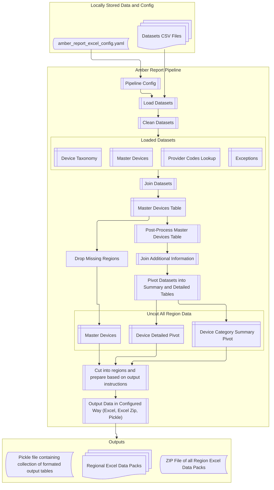

# Amber Report Pipeline Process Maps

This page provides a visual overview of the Amber Report Pipeline, detailing the end-to-end data processing flow from raw data ingestion to final report generation.

## Main Pipeline Flow Summary

The Amber Report Pipeline goes through several stages to process the data to produce the regional reports. These stages are:

1. **Configuration**: Load the pipeline configuration and dataset paths.
2. **Data Loading**: Load datasets from CSV files using information from the configuration.
3. **Data Cleaning**: Normalise the column names and clean the datasets
4. **Data Joining**: Join datasets to create a master devices table.
5. **Post-Processing**: Cleanse the master devices table, resolving inconsistencies and missing values.
6. **Pivoting**: Create summary and detailed pivot tables.
7. **Joining Additional Information**: Join on key columns from the lookup table to add back in data lost during the pivoting.
8. **Preparing Outputs**: Cut the data into regions and prepare it based on the output instructions.
9. **Output**: Generate the final output in the configured formats (Excel, Excel Zip, Pickle).

These steps are visualised in the following diagram:

## Detailed Pipeline Steps

This diagram provides a more detailed view of the Amber Report Pipeline, showing each step in the process and how they interact with each other:

```mermaid
---
config:
    layout: elk
    elk:
        mergeEdges: true
        nodePlacementStrategy: LINEAR_SEGMENTS
    flowchart:
        curve: linear
---
flowchart TD
    subgraph uncut_datasets["Uncut All Region Data"]
        summary_data["Device Category Summary Pivot"]
        detailed_data["Device Detailed Pivot"]
        master_devices_table_drop_na["Master Devices"]
    end
    subgraph output_data["Output the Data"]
        output_formats{"What output formats have been Configured?"}
        create_excel_reports[["Create Excel Reports"]]
        excel_zip{"Should the excel outputs be packaged in an ZIP File?"}
        create_excel_zip_reports[["Package Excel Reports in ZIP File"]]
        create_pickle[["Create Pickle file"]]
    end
    subgraph amber_report_pipeline["Amber Report Pipeline"]
        config["config"]
        load_devices_datasets[["Load Datasets"]]
        clean_datasets["clean_datasets"]
        loaded_datasets["loaded_datasets"]
        join_datasets["join_datasets"]
        master_devices_table["Master Devices Table"]
        cleanse_master_joined_dataset[["Post-Process Master Devices Table"]]
        pivot_datasets["pivot_datasets"]
        join_mini_tables["join_mini_tables"]
        dropna["Drop Missing Regions"]
        uncut_datasets
        prepare_outputs
        output_data
    end
    subgraph local_storage["Locally Stored Data and Config"]
        master_devices_csv["master_devices.csv"]
        provider_codes_lookup_csv["provider_codes_lookup.csv"]
        device_taxonomy_csv["device_taxonomy.csv"]
        csv4["exceptions.csv"]
        amber_report_excel_config["amber_report_excel_config.yaml"]
    end
    subgraph output_storage["Outputs"]
        excel_files["Regional Excel Data Packs"]
        zip_excel_files["ZIP File of all Region Excel Data Packs"]
        pickle["Pickle file containing collection of formatted output tables"]
    end
    subgraph config["Config"]
        define_dataset_paths["Define the Dataset Paths"]
        check_paths["Check Dataset Paths Exist"]
        load_amber_report_excel_config["Load the Output Format Config"]
        create_output_directory["Create the Output Directory"]
        dataset_config["Dataset Config"]
        amber_report_output_instructions["Amber Report Output Instructions"]
    end
    subgraph loaded_datasets["Loaded Datasets"]
        master_devices["Master Devices"]
        provider_codes_lookup["Provider Codes Lookup"]
        device_taxonomy["Device Taxonomy"]
        exceptions["Exceptions"]
    end
    subgraph join_datasets["Join"]
        join_provider_codes_lookup[["Join Provider Codes Lookup"]]
        join_device_taxonomy[["Join Device Taxonomy"]]
        join_exceptions[["Join Exceptions"]]
    end
    subgraph clean_datasets["Clean"]
        batch_normalise_column_names[["Normalise Datasets Column Names"]]
        cleanse_master_data[["Clean Master Data"]]
        cleanse_device_taxonomy[["Clean Device Taxonomy"]]
        cleanse_exceptions[["Clean Exceptions"]]
    end
    subgraph pivot_datasets["Pivot"]
        create_device_category_summary_table[["Create Device Category Summary Pivot Table"]]
        create_device_summary_table[["Create Device Detailed Pivot Table"]]
    end
    subgraph join_mini_tables["Join on additional information"]
        join_mini_provider_codes_lookup[["Join Mini Provider Codes Lookup"]]
        join_mini_device_taxonomy[["Join Mini Device Taxonomy"]]
        join_mini_exceptions[["Join Mini Exceptions"]]
    end
  subgraph prepare_outputs["Prepare Datasets for Output"]
        create_regional_table_cuts[["Cut data into regions"]]
        interpret_output_instructions[["Process Data Based on Output Instructions"]]
    end
    load_devices_datasets --> batch_normalise_column_names
    batch_normalise_column_names --> cleanse_master_data & cleanse_device_taxonomy & cleanse_exceptions & provider_codes_lookup
    cleanse_master_data --> master_devices
    cleanse_device_taxonomy --> device_taxonomy
    cleanse_exceptions --> exceptions
    master_devices --> join_provider_codes_lookup
    provider_codes_lookup --> join_provider_codes_lookup & join_mini_provider_codes_lookup
    join_provider_codes_lookup --> join_device_taxonomy
    device_taxonomy --> join_device_taxonomy & join_mini_device_taxonomy
    exceptions --> join_exceptions & join_mini_exceptions
    join_device_taxonomy --> join_exceptions
    join_exceptions --> master_devices_table
    master_devices_table --> cleanse_master_joined_dataset
    cleanse_master_joined_dataset --> create_device_category_summary_table & create_device_summary_table & dropna
    dropna --> master_devices_table_drop_na
    summary_data --> create_regional_table_cuts
    detailed_data --> create_regional_table_cuts
    master_devices_table_drop_na --> create_regional_table_cuts
    create_regional_table_cuts --> interpret_output_instructions
    output_formats -- Excel --> create_excel_reports
    output_formats -- Pickle --> create_pickle
    create_excel_reports --> excel_zip
    excel_zip -- Yes --> create_excel_zip_reports
    excel_zip -- No --> excel_files
    create_pickle --> pickle
    create_excel_zip_reports --> zip_excel_files & excel_files
    define_dataset_paths --> check_paths
    load_amber_report_excel_config --> amber_report_output_instructions
    check_paths --> dataset_config
    dataset_config --> load_devices_datasets
    amber_report_excel_config --> load_amber_report_excel_config
    csv4 --> load_devices_datasets
    amber_report_output_instructions --> interpret_output_instructions
    interpret_output_instructions --> output_formats
    device_taxonomy_csv --> load_devices_datasets
    master_devices_csv --> load_devices_datasets
    provider_codes_lookup_csv --> load_devices_datasets
    create_output_directory --> output_formats
    join_mini_provider_codes_lookup --> join_mini_device_taxonomy
    join_mini_device_taxonomy --> join_mini_exceptions
    create_device_summary_table --> join_mini_provider_codes_lookup
    create_device_category_summary_table --> join_mini_provider_codes_lookup
    join_mini_exceptions --> detailed_data & summary_data
    summary_data@{ shape: internal-storage}
    detailed_data@{ shape: internal-storage}
    master_devices_table_drop_na@{ shape: internal-storage}
    master_devices_table@{ shape: internal-storage}
    master_devices_csv@{ shape: stored-data}
    provider_codes_lookup_csv@{ shape: stored-data}
    device_taxonomy_csv@{ shape: stored-data}
    csv4@{ shape: stored-data}
    amber_report_excel_config@{ shape: stored-data}
    master_devices@{ shape: internal-storage}
    provider_codes_lookup@{ shape: internal-storage}
    device_taxonomy@{ shape: internal-storage}
    exceptions@{ shape: internal-storage}
    excel_files@{ shape: docs}
    zip_excel_files@{ shape: stored-data}
    pickle@{ shape: stored-data}
```

!!! Note
    If you want to get further details on the steps of the Amber Report Pipeline, it is recommend you look at the codebase or the [API Reference](api_reference/index.md) documentation.

